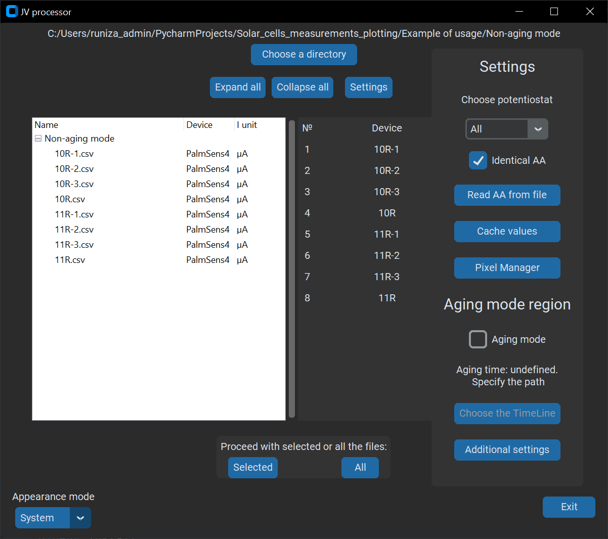

# Non-Aging Mode Usage Guide

## Overview

This guide provides basic instructions for using the Non-Aging Mode (the "Aging mode" checkbox is not checked) of the JV processor. It is important to note that this is not an exhaustive manual; rather, it covers fundamental operations, and other essential features to get you started.

## Quick Start

1. **Choose Data Directory**: Upon running the program, click the "Choose a directory" button to select the folder containing your raw IV data. This directory can contain other file types but **must not** include any sub-folders.

2. **Active Area Configuration**: If the "active area" file is absent, you will need to specify the active area for your devices. By default, the "Identical AA" setting is applied, assuming a uniform active area across all devices.

3. **Pixel manager**: The Pixel manager is available for all options. Here you can average multiple pixels into a single device, thus simplifying the analysis and data representation process. This is more for advanced users.

4. **Additional Settings**: Navigate to the 'Additional Settings' panel where you can adjust the light intensity (measured in W/m²) and the distance to the light source (in mm). Under 'Excel settings,' ensure 'Open WB' and 'Colorful tabs' are selected if you desire a more vibrant output in Excel. 'Filters' are available for advanced users who wish to refine the data processing further.

5. **Processing Data**: To process the data, click 'All' to proceed with every item or select specific entries in the treeview (the left table) and then click 'Select.'

6. **View Results**: Once the processing is complete, you can enjoy [the results](2024-01-15%20Non-aging%20mode%20JV%20plots%20and%20calculations.xlsx) which will include the analyzed data and corresponding graphical representations.

## Important Notes

- Ensure the directory chosen does not contain sub-folders, as they are not supported in the current version.
- The default settings assume uniformity across devices. Should this not be the case, please specify the active area for each device accordingly.
- Adjusting light intensity and the distance to the light source can significantly affect the outcome. Please ensure accurate values are entered.
- 'Filters' should be used with caution and are recommended for those familiar with advanced data analysis techniques.

Enjoy using the JV processor in Non-Aging Mode to enhance your photovoltaic research and analysis!
