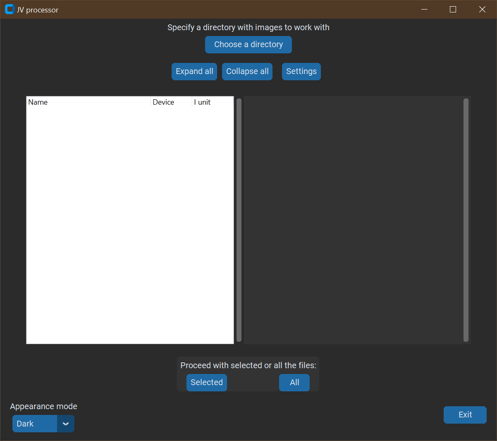
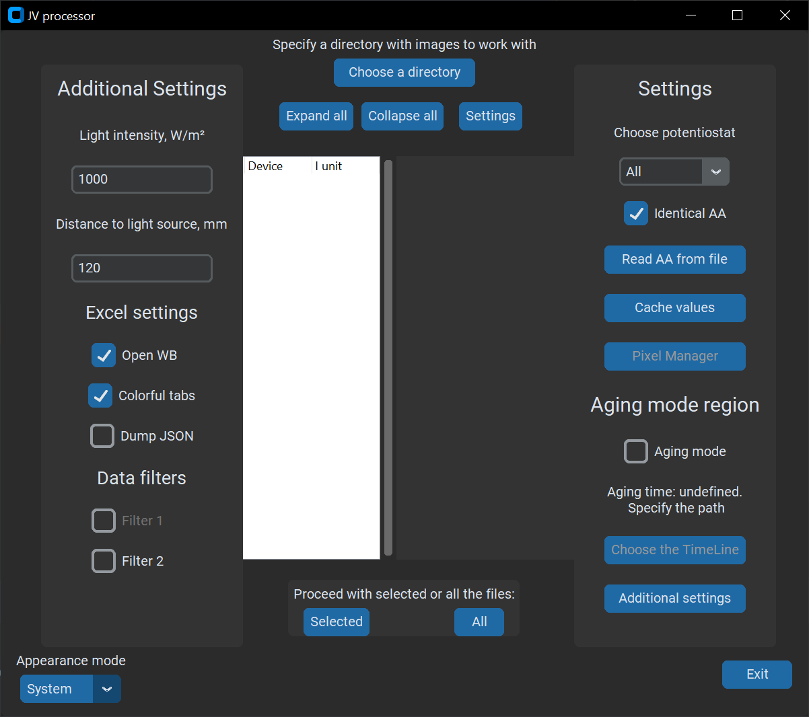
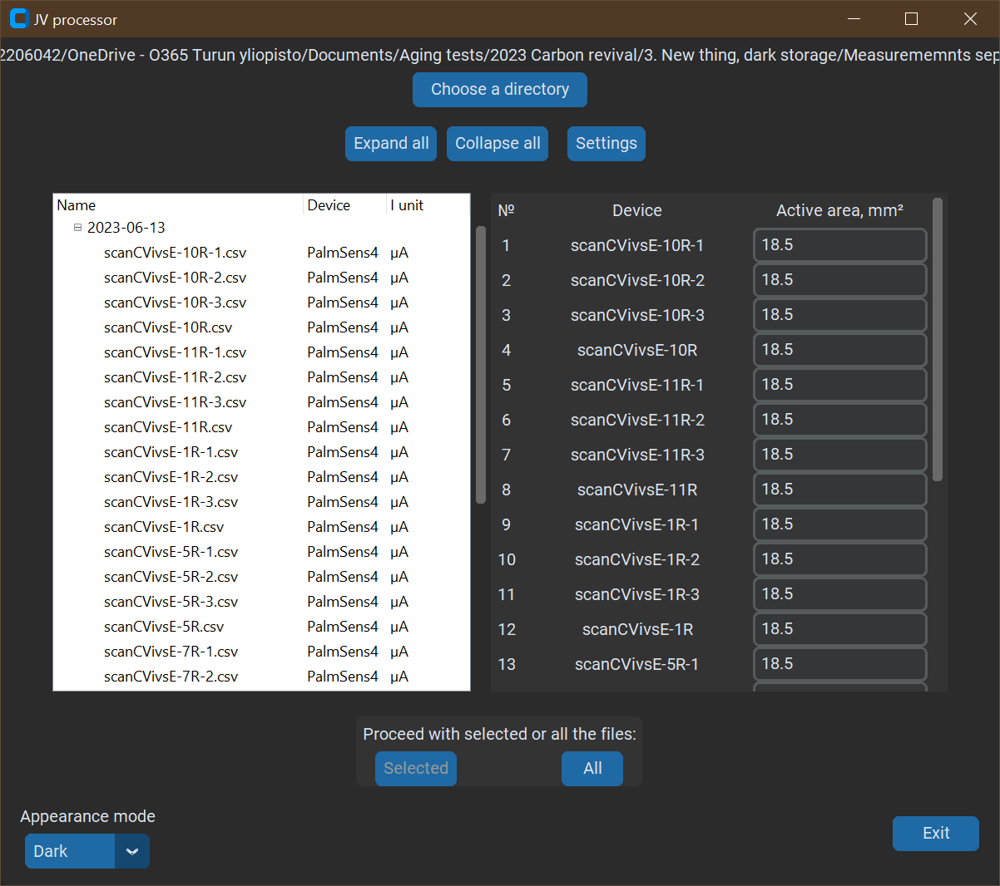
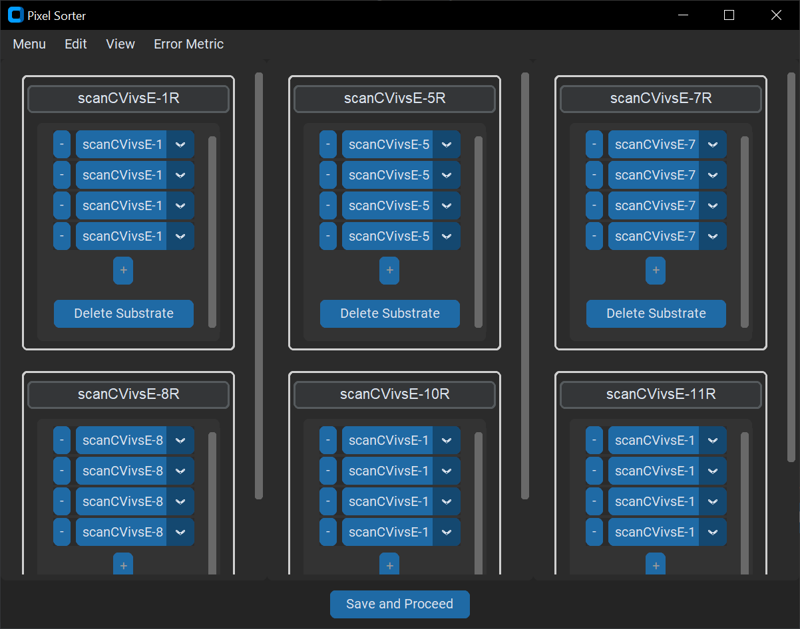
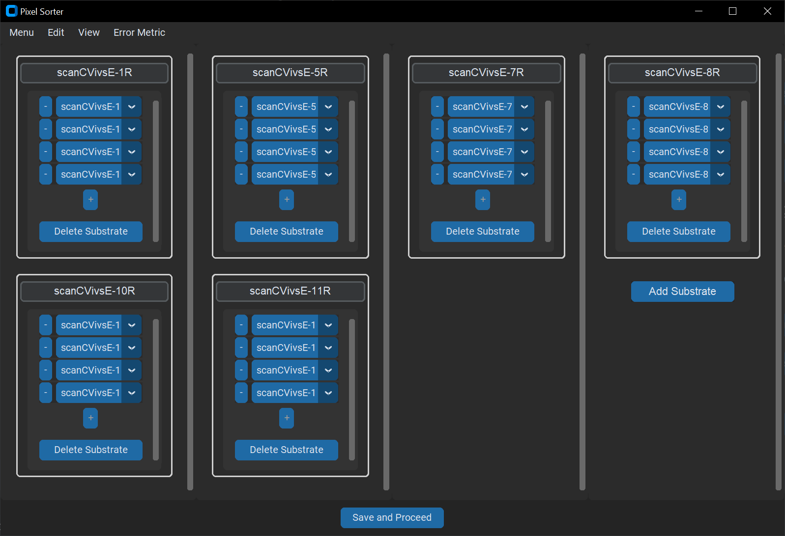
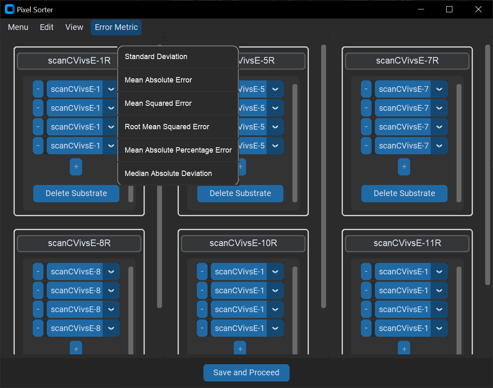

# JV processor

## Description

This project aims to help researchers to analyze their JV curves for different photovoltaic applications and helps better investigate the degradation mechanisms of emerging solar cells. It could be used to analyze the data produced by accelerated ageing and visual tracking systems to improve the stability of these solar cells.

## Table of Contents

- [Installation](#installation)
- [Usage](#usage)
  - [Supported Potentiostats](#supported-potentiostats)
  - [Dependencies](#dependencies)
- [Contributing](#contributing)
- [License](#license)
- [Contact](#contact)

## Installation

1. **Clone the repository**
    ```bash
    git clone https://github.com/Rusya665/Solar_cells_measurements_plotting
    ```

2. **Install dependencies**

    ### Using Pipfile (Recommended)
    ```bash
    pip install pipenv  # If pipenv is not installed
    cd Solar_cells_measurements_plotting
    pipenv install
    pipenv shell
    ```
    ### Using requirements.txt
    ```bash
    cd Solar_cells_measurements_plotting
    pip install -r requirements.txt
    ```

## Usage

Settings panels

Aging mode example

Now Pixel sorter is also available

Now Pixel sorter may be customized

Users now may decide which Error Metric to use

For cases with Windows scaling enabled,
apply the solution from [this Stack Overflow post](https://stackoverflow.com/questions/62794931/high-dpi-tkinter-re-scaling-when-i-run-it-in-spyder-and-when-i-run-it-direct-in/62937256#62937256)
to override the DPI settings.

### Supported Potentiostats

The project currently supports the following potentiostats and their respective file formats:

- **Gamry**: `.DTA`, automated current unit detection
- **PalmSens4**: `.csv`, automated current unit detection
- **SMU**: `.txt`, current is set to amps (A)
- **SP-150e**: `.mpt`, automated current unit detection, preconditioning is taken into account

## Dependencies

- Python 3.9+
- Key packages: `matplotlib`, `numpy`, `pandas`, `scipy`, `xlsxwriter`, `customtkinter`
- For a complete list of packages, see `Pipfile` or `requirements.txt`

## Contributing

1. Fork the project
2. Create your feature branch (`git checkout -b feature/YourFeature`)
3. Commit your changes (`git commit -m 'Add some feature'`)
4. Push to the branch (`git push origin feature/YourFeature`)
5. Open a pull request

## License

This project is licensed under the MIT License.

## Contact

Rustem Nizamov - rusya665@gmail.com
